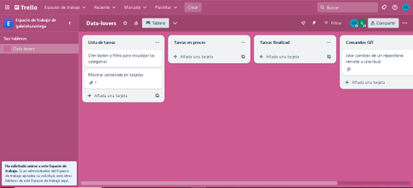
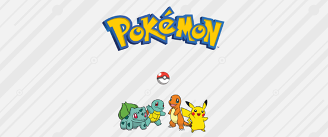
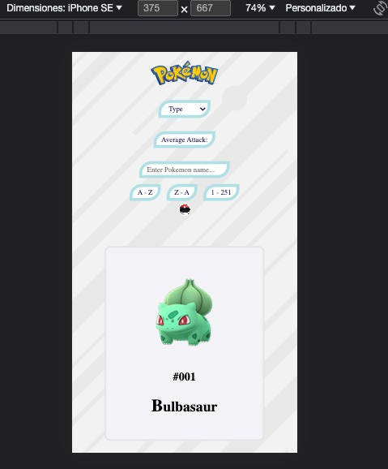
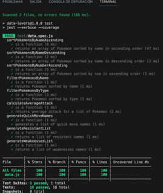

# ¡Data-Lovers Pokémon!

## Índice

* [1. Introducción](#1-introducción)
* [2. Elaboracíon ](#2-elaboración)
* [3. Historias de usuario](#3-historias-de-usuario)
* [4. Alta Fidelidad](#4-alta-fidelidad)
* [5. Responsive](#5-responsive)
* [6. Testeos de usabilidad](#6-testeos-de-usabilidad)
* [7. Objetivos de aprendizaje](#7-objectivos-de-aprendizaje)
* [8. Checklist](#8-checklist)

## 1. Introducción

Según [Pokemon Wiki](https://pokemon.fandom.com/es/wiki/Generaciones_Pok%C3%A9mon)
Las Generaciones I y II de Pokémon, representadas por los juegos "Pokémon Rojo y Azul" y "Pokémon Oro y Plata", respectivamente, son los pilares fundamentales que dieron origen y continuidad a la icónica franquicia Pokémon. Estas generaciones no solo introdujeron a los jugadores al emocionante mundo de los entrenadores Pokémon, sino que también expandieron y mejoraron significativamente la experiencia de juego. Desde la captura de los 151 Pokémon originales en Kanto hasta la introducción de 100 nuevas criaturas en Johto, estas dos generaciones marcaron el comienzo de un fenómeno cultural que ha perdurado durante décadas. Acompáñanos en un viaje a través de estas dos eras que dieron forma a la forma en que millones de personas en todo el mundo experimentan el universo Pokémon.

## 2. Elaboración

Lo primero que desarrollamos fue la planeacion y organización de nuetro proyecto con la aplicaccion trello.

## 3. Historias de usuario

Se han creado los primeros bocetos sugeridos por nuestros usuarios para el diseño inicial de la interfaz, comenzando con la imagen inicial del logo, seguida de los principales Pokémon.

En la página de inicio, se encuentra un botón en forma de Pokébola junto al logo de Pokémon y una imagen de los Pokémon más populares. Al hacer clic en este botón, se accede a la segunda página.

En la segunda página, los datos se presentan en forma de tarjetas. Estas tarjetas representan a los Pokémon del 1 al 251, en orden ascendente. Cuando el usuario se sitúa sobre una tarjeta de un Pokémon específico, se despliega la información relacionada con ese Pokémon.

## 4 Alta Fidelidad

La aplicación permitirá: Ordenar Pokémon de diversas formas, filtrar por tipo, buscar por nombre, calcula el promedio de la efectividad de los ataques por tipo.

 

 
* [Figma](https://www.figma.com/file/tumuHLKHR7Twk7Nu6InR5B/Untitled?type=whiteboard&node-id=507-247&t=chMtxgcWdjlMdycb-0): En esta aplicación encontrara toda la documentación generada en cada etapa del proceso.

## 5 Responsive

Se refiere a la capacidad de un sitio web o una aplicación para adaptarse de manera dinámica y eficiente a diferentes tamaños de pantalla y dispositivos. Esto garantiza que la experiencia del usuario sea óptima, ya sea que estén navegando en una computadora de escritorio, una tableta o un teléfono móvil. Un diseño web o una aplicación "responsive" se ajusta automáticamente para mostrar y organizar el contenido de manera legible y funcional en cualquier dispositivo, lo que mejora la accesibilidad y la usabilidad, y evita que los usuarios tengan que hacer zoom o desplazarse excesivamente para ver o interactuar con la información.

* [Figma](https://www.figma.com/file/tumuHLKHR7Twk7Nu6InR5B/Untitled?type=whiteboard&node-id=507-247&t=chMtxgcWdjlMdycb-0): En esta aplicación encontrara toda la documentación generada en cada etapa del proceso.

## 6 Testeos de usabilidad

Son evaluaciones sistemáticas que se realizan en productos, como sitios web, aplicaciones móviles o productos físicos, para medir la facilidad con la que los usuarios pueden interactuar con ellos. Estos test se llevan a cabo con usuarios reales o representativos del público objetivo.

El objetivo principal de los testeos de usabilidad es identificar problemas en la experiencia del usuario, como dificultades de navegación, diseño confuso o funciones poco intuitivas. Estos test suelen incluir tareas específicas que los usuarios deben realizar mientras se registran sus interacciones y comentarios.

* [Figma](https://www.figma.com/file/tumuHLKHR7Twk7Nu6InR5B/Untitled?type=whiteboard&node-id=507-247&t=chMtxgcWdjlMdycb-0): En esta aplicación encontrara toda la documentación generada en cada etapa del proceso.

## 7 Objectivos de aprendizaje

En esta ocacion logramos entender mas sobre las siguientes funciones:

# HTML

* Comprender los conceptos básicos y su estructura.
* Conocer la importancia de utilizar elementos semánticos en HTML para mejorar la accesibilidad y la optimización de motores de búsqueda.
* Identificar y utilizar correctamente los elementos semánticos, como: header, article, section, footer, entre otros.

# CSS 
* Entender los conceptos básicos de CSS, incluyendo selectores, propiedades y valores.
* Aprender a aplicar estilos a elementos HTML para controlar el diseño y la apariencia de una página web.
* Conocer las diferentes unidades de medida y cómo se aplican en CSS (píxeles, porcentajes, etc.).
* Dominar la creación de reglas CSS para modificar colores, fuentes, márgenes, bordes y fondos

# Javascript

* Aprender a manipular el DOM (Document Object Model) con JavaScript para interactuar con elementos HTML.
* Comprender la programación orientada a objetos en JavaScript, incluyendo objetos, métodos y propiedades.
* Conocer cómo trabajar con eventos y controladores de eventos para crear interacciones en una página web.

## 8 Checklist

 * Pasa linter (npm run pretest)
 * Pasa tests (npm test)
 * Pruebas unitarias cubren el 100% de statements, functions y lines y branches.
 * Incluye Definición del producto clara e informativa en README.md.
 * Incluye historias de usuario en README.md.
 * Incluye sketch de la solución (prototipo de baja fidelidad) en README.md.
 * Incluye Diseño de la Interfaz de Usuario (prototipo de alta fidelidad) en README.md.
 * Incluye link a Zeplin en README.md.
 * Incluye el listado de problemas que detectaste a través de tests de usabilidad en el README.md.
 * Muestra lista y/o tabla con datos y/o indicadores.
 * Permite ordenar data por uno o más campos (asc y desc).
 * Permite filtrar data en base a una condición.
 * Es responsive.
